# PillPal User's Manual

## Mobile Application
Elderly people often need to take around 8 medicines daily. Keeping track of them and organizing them properly can be a challenging task. Not only do they need reminders to take their medications, but they also need to remember important information about each medicine. To assist these individuals, we are continuously developing this application. We have numerous ideas to improve this core app, so stay tuned!
**Note:** For now, this is only available for Android, but we will publish it on iOS as well later on.

### What We Do BETTER
Our application helps users create reminders for taking medications, just like other similar apps, but it offers much more! Users can select medicines from a pre-filled database, making it easy to access information about their medications without manually entering complex data.
- **Easy-to-handle reminders ✔️**
- **Accessible medicine information 💊**
- **Opportunities to revolutionize medicine reminder apps 🚀**

### Account Handling
- Every reminder is linked to an account, making them independent of any device. For example, if you change your mobile device, all your reminders will still be available.
- When you are logged out (or not logged in), the application automatically starts on the login page, allowing you to log in immediately.
- If you don't have an account, you can easily register one with a unique username and a secure password.

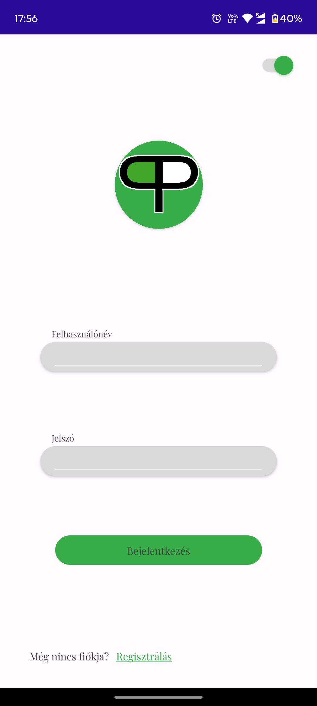 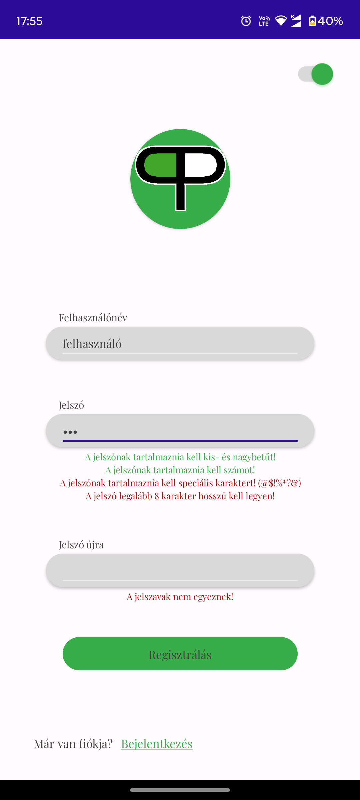

### Menu Button
To simplify navigation between different pages, the app features a circular radial menu button with the following options:
- Adding a new reminder ➕
- Your reminders home page 🏠
- Application settings ⚙️

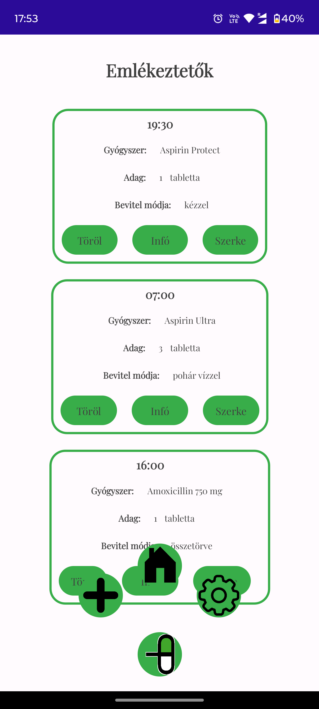

### Viewing Your Reminders
- The main page displays all your reminders in simplified cards.
- Reminders are ordered by time, with the closest upcoming reminder (not yet triggered for the day) displayed first, making it easier to find the most relevant one.
- Each card shows the scheduled time, the medicine, the dosage, and the method of intake.
- A reminder card also includes three buttons: *delete* to remove an unwanted reminder, *edit* to make changes, and *info* to learn more about the medicine.

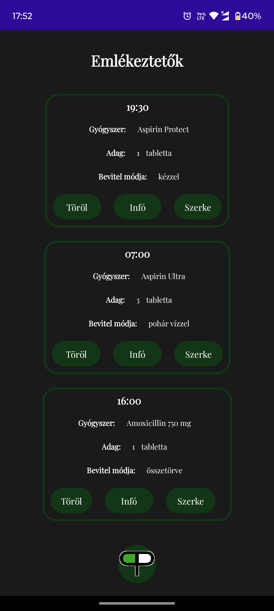 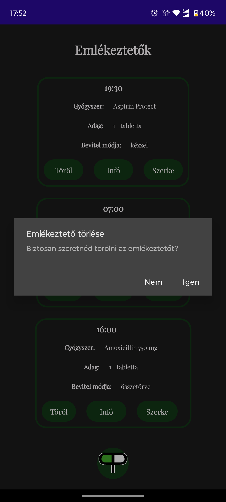
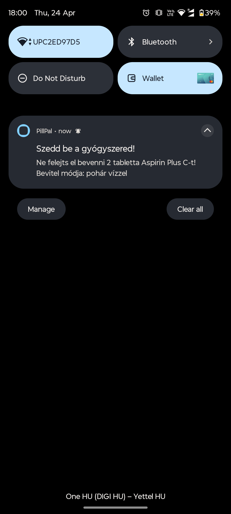

### Editing a Reminder
On the reminders home page, you can click the *edit* button on a reminder card to make changes.
- This screen includes a search bar with a medicine list below, allowing you to select a different medicine if needed.
- Below this, you can edit the dosage, schedule time, and method of intake.
- To save changes, tap the *save* button, which will return you to the home page upon success.
- If you change your mind, tap the *back* button to discard modifications and return to the home page.

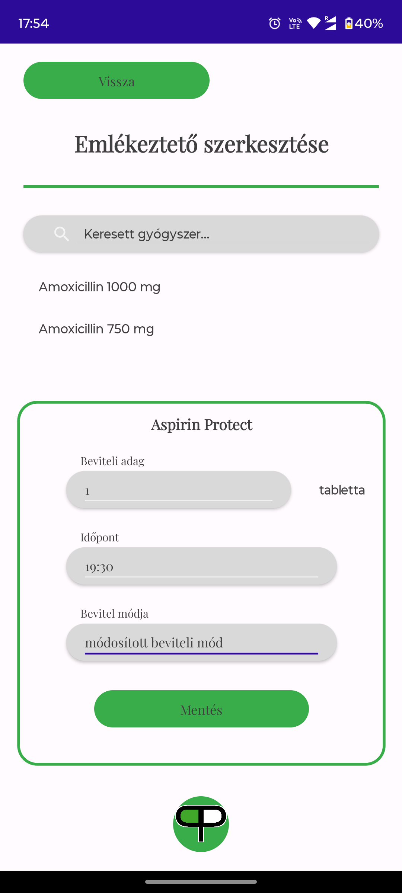  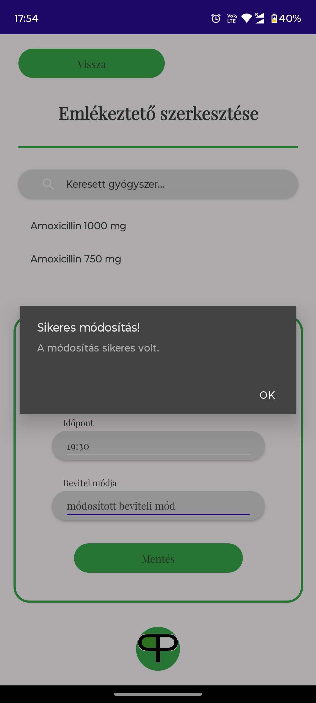

### Medicine Information
Sometimes, you may need to check for possible side effects, active ingredients, or what does the medicine cure. Normally, you would need to search for the description, which you may have lost years ago. With this app, you can access all this information quickly and easily in a well-structured format.

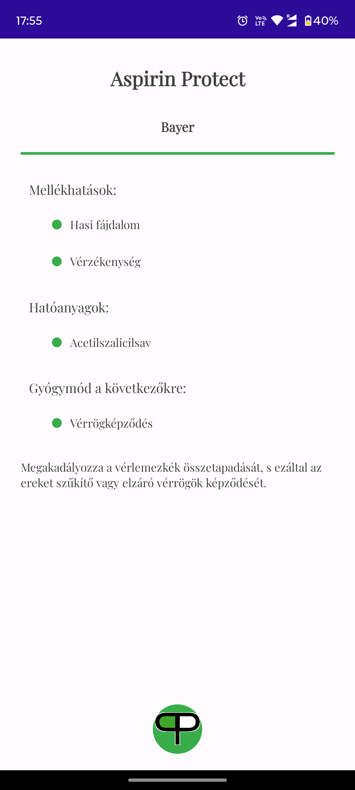

### Creating a New Reminder
Reminders are the core feature of this app, and there is a dedicated page for creating them. This page is structured similarly to the edit page.
- It includes a search bar with a medicine list below, allowing you to select the medicine you need to take.
- Below this, you can set the dosage, schedule time, and method of intake.
- To add the new reminder, tap the *add* button, which will return you to the home page upon success.

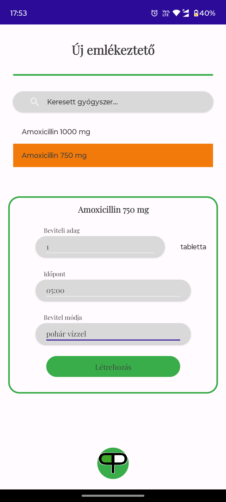 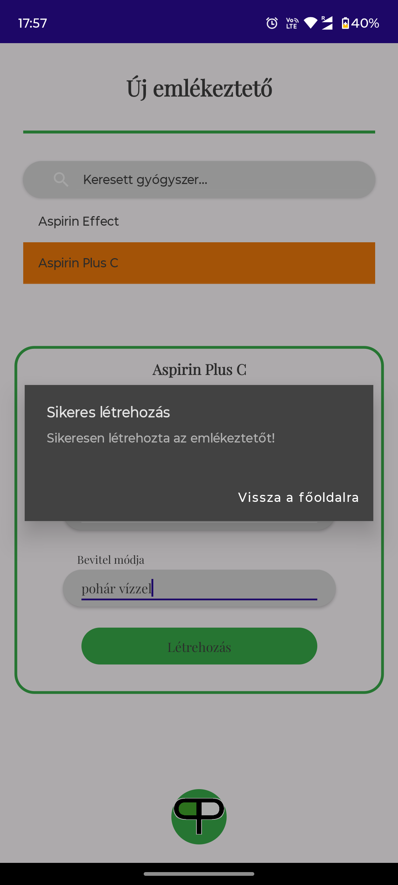

### Application Settings
This page currently includes a few options but will be expanded in the future. Here, you can:
- Switch between dark mode and light mode.
- Log out of your account to log into another.
- Remove your account if you no longer need it or want to reset it.

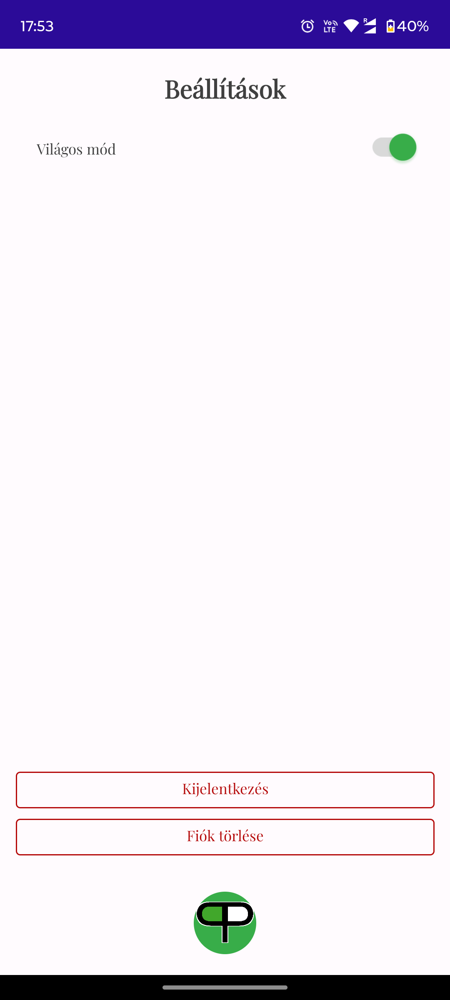

## Admin Web App

We developed a user-friendly web app using Vue for administrators to manage users and all data related to medicines.

### Login Page
This page is pretty straightforward. Used to verify that you have the proper access level and an account. If you log out or your account is deleted while logged in, the web app redirects you to this page, requiring you to log in again. Enter your username and the correct password to access the system.

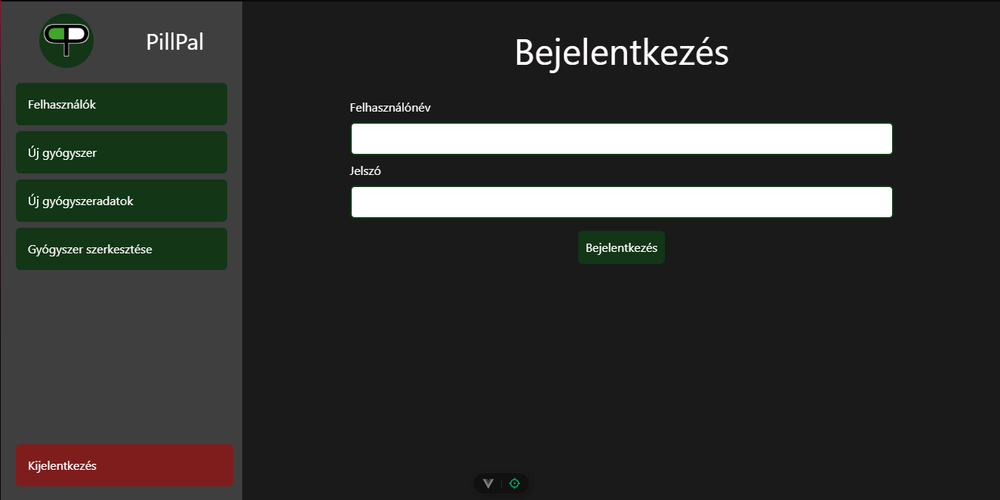

### Navbar
To simplify navigation, we included a collapsible sidebar, ensuring the page works well on all devices.

### Users Page
Sometimes, users may behave inappropriately. To address such scenarios, administrators can delete users. This page displays all users in a list, showing their username, the number of reminders they have, and a *remove* button for deleting specific users. A search bar is also available to quickly find users by their username. Clicking the *remove* button triggers a confirmation popup to prevent accidental deletions.

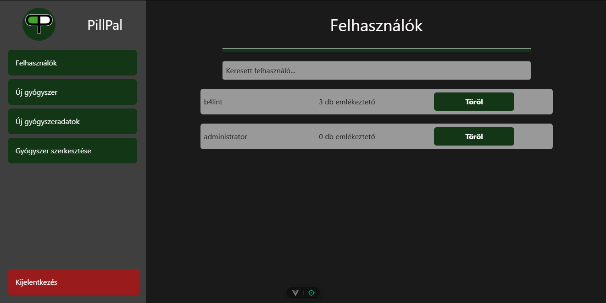

### Adding New Medicines
Administrators can extend the variety of medicines by filling out a form on this page and saving it by clicking the button. The fields are intuitive, and validation messages guide you in entering the correct data. To add a new package unit that doesn't exist, use the *New Medicine Data Page*. The page provides feedback upon successfully adding a medicine.  
**Note:** This page only creates the medicine. To add more data to a medicine, use the *Edit Medicine Page*.

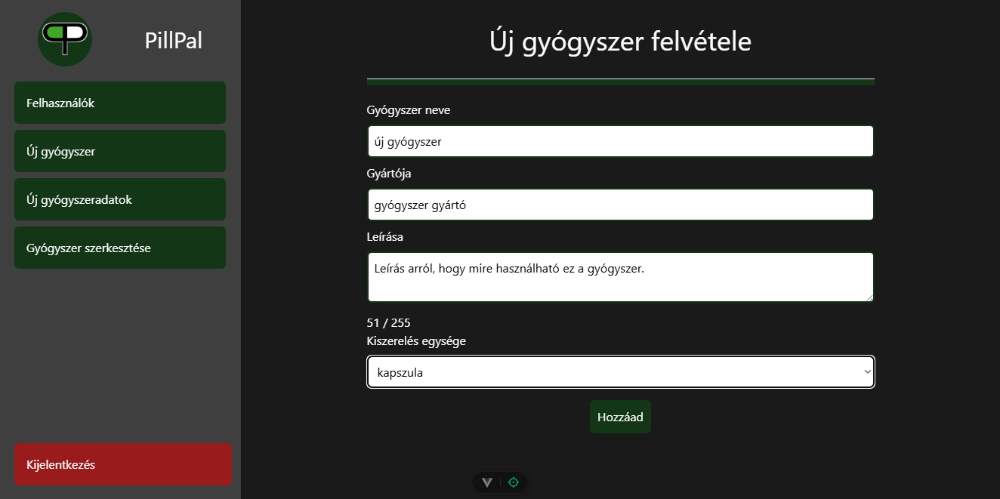

### Editing Medicines
Mistakes happen, so administrators can correct them by editing, deleting, or adding more data to existing medicines. The page includes a search bar to find specific medicines by name. Once selected, all its data is loaded into a form and displayed in four sections. You can modify the data in the form and save changes by clicking the *modify* button. If a medicine is no longer available, you can delete it by clicking the *delete* button, which will ask for confirmation.  
Each section allows you to manage specific data:
- **Side Effects:** Add or remove side effects. The input field is a dropdown with existing options, which can be extended via the *New Medicine Data Page*.
- **Active Ingredients:** Add or remove active ingredients. The input field is a dropdown with existing options, which can be extended via the *New Medicine Data Page*.
- **Ailments:** Add or remove ailments the medicine treats. The input field is a dropdown with existing options, which can be extended via the *New Medicine Data Page*.
- **Package Sizes:** Add or remove package sizes. The input field is a number input, which must be unique for that medicine.

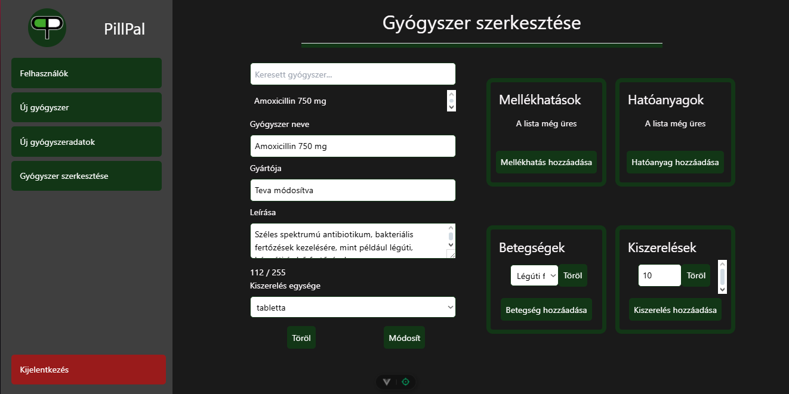

### New Medicine Data Page
In some cases, you may need to add options for package units, side effects, active ingredients, or ailments. This page includes four sections, each with a search bar for finding items by name. Clicking on an item switches the view below.  
- The default view includes an input field and an *add* button. Enter the item name and click *add* to save it to the database.
- The switched view allows you to modify or delete existing items. Edit the value in the input field and click *modify* to save changes. To delete an item, click *remove*, which will ask for confirmation.  
- To switch back to the default view, click *cancel*, which deselects the item in the list.
Each section is dedicated to managing side effects, active ingredients, ailments, and package units independently.

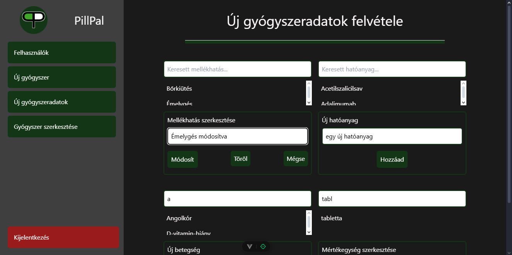
